<picture>
  <source media="(prefers-color-scheme: dark)" srcset="assets/banner-dark.svg">
  <source media="(prefers-color-scheme: light)" srcset="assets/banner-light.svg">
  
</picture>

I am a 5th-year cybersecurity and network infrastructure engineering student at EMSI Casablanca. I started as a developer (C, C++, Java, Django, PHP), which is why, when I study an attack, I end up building the thing that detects it.

**Looking for a PFE internship from early 2027**, 4 to 6 months, in SOC, detection engineering or incident response. Casablanca, Rabat or remote.

 

### Two things I built

**[Distributed SOC lab](https://github.com/RedaKarrach/distributed-soc-lab)** &nbsp;·&nbsp; a working security operations centre on two machines. Wazuh watches the endpoints, Shuffle runs the response playbook, Cortex enriches each alert with threat intelligence, TheHive opens the incident case. Validated end to end with Atomic Red Team attacks, from the simulated intrusion to the classified case.

**[ReconTool](https://github.com/RedaKarrach/NetworkReconnaissanceTool)** &nbsp;·&nbsp; a real-time network intrusion detection platform. Python agents on each machine spot port sweeps, SYN floods and ARP spoofing, block the source, and stream alerts to a live React dashboard with a risk score per host and PDF reports.

Also: [ChainShop Nexus](https://github.com/RedaKarrach/chainshop-nexus), trustless e-commerce on Ethereum (Solidity, Hardhat, Next.js); a web penetration test with documented SQLi and XSS findings; and the SOC team of **Exercice KASBAH** (EMSI × CyberSup), a three-day ransomware crisis simulation.

 

### Where I have worked

**Application security intern** &nbsp;·&nbsp; built a deliberately vulnerable Django REST application, then broke it and fixed it: OWASP findings reproduced with Burp Suite (SQL injection, XSS, broken access control), proofs of concept, and remediation shipped (parameterised queries, RBAC, output escaping, Content Security Policy). CVE monitoring on Django and first steps in DevSecOps. A short geomatics mission on the side (QGIS, PyQGIS, PostGIS).

 

### What I work with

| | |
|---|---|
| **Defend** | Wazuh, Shuffle, TheHive, Cortex, MITRE ATT&CK, Atomic Red Team, Scapy, Wireshark |
| **Attack (lab only)** | Kali Linux, Burp Suite, Nmap, Hydra, OWASP Top 10 |
| **Build** | Python, Django and DRF, JavaScript, React, Next.js, Node.js, C, C++, Java, PHP, Docker |
| **Run** | Linux, TCP/IP, GNS3, Zabbix, Prometheus, Grafana, MySQL, MongoDB |
| **Studying now** | digital forensics, cloud security, GRC (ISO 27001, NIST CSF), cryptanalysis |

 

**[redakarrach.github.io](https://redakarrach.github.io)** &nbsp;·&nbsp; [LinkedIn](https://www.linkedin.com/in/reda-karrach-a2a52730b) &nbsp;·&nbsp; [redanb136@gmail.com](mailto:redanb136@gmail.com)

Every offensive tool in these repositories is built and used in isolated lab networks only.
