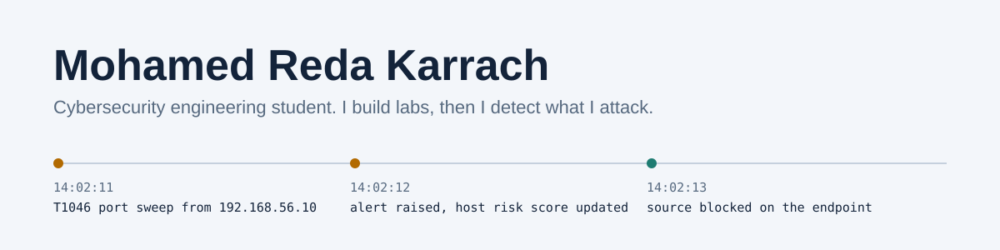

<picture>
  <source media="(prefers-color-scheme: dark)" srcset="assets/banner-dark.svg">
  <source media="(prefers-color-scheme: light)" srcset="assets/banner-light.svg">
  
</picture>

I'm a 5th-year **cybersecurity & network infrastructure engineering** student at EMSI Casablanca, graduating in 2027. My foundation is in programming (C, C++ and OOP, Java) and web development (Django, PHP), so when I study an attack I usually end up building the tool that detects it.

**Looking for:** a PFE (end-of-studies) internship in **SOC / detection engineering / incident response**, with an interest in cloud security.

---

### Experience

**Security internship: application security and geomatics automation**

- Built a deliberately vulnerable e-commerce application on **Django REST Framework** and MySQL as a hands-on security test target.
- Identified, reproduced and documented OWASP vulnerabilities with **Burp Suite** and manual testing, with proofs of concept for **SQL injection, XSS and broken access control**.
- Wrote technical reports with impact analysis and concrete fixes: parameterized queries, RBAC, HTML output escaping, Content Security Policy.
- Monitored Django CVEs and recommended cross-cutting improvements: security checks in CI/CD, WAF deployment, least privilege. Introduced to DevSecOps practices.
- Short observational mission in geomatics: GIS workflows and automation with **QGIS / PyQGIS** (data cleaning, batch processing, exports) and PostGIS.

---

### Featured work

**[Automated incident response playbooks: distributed SOC lab](https://github.com/RedaKarrach/distributed-soc-lab)**
Two-machine SOC over a dedicated LAN: Wazuh (SIEM) and Shuffle (SOAR) on one node, TheHive (case management) and Cortex (enrichment) on the other, with Windows and Linux endpoints. Attacks replayed with Atomic Red Team are followed end to end, for example cron persistence (T1053.003) raising a Wazuh alert, triggering the Shuffle playbook, and opening a classified TheHive case.
`Wazuh` `Shuffle` `TheHive` `Cortex` `Atomic Red Team`

**[ReconTool: real-time network intrusion detection platform](https://github.com/RedaKarrach/NetworkReconnaissanceTool)**
End-of-year project (PFA). Python/Scapy agents sniff traffic on lab endpoints, detect SYN floods, ARP spoofing and ICMP redirects, and can block the source with `iptables` / `netsh`. Alerts stream over WebSockets to a React SOC dashboard, mapped to MITRE ATT&CK (T1046, T1557, T1498), with per-host risk scoring, agent health monitoring and PDF session reports.
`Scapy` `Django Channels` `MongoDB` `React 18` `D3.js` `Docker Compose`

**[ChainShop Nexus: trustless e-commerce on Ethereum](https://github.com/RedaKarrach/chainshop-nexus)**
Monorepo with three Solidity contracts (escrow, order registry, reviews) tested with Hardhat, an Express API gateway, an ethers.js event indexer and a Next.js 14 front end.
`Solidity` `Hardhat` `ethers.js` `Express` `Next.js` `MongoDB`

**Web penetration testing project**
Exploited and documented XSS and SQL injection on a test web application, with remediation for each finding.

---

### What I work with

| Area | Tools and skills |
|---|---|
| SOC / Blue Team | Wazuh (deployment, agents, active response), Shuffle, TheHive, Cortex, threat-intel APIs (VirusTotal, AbuseIPDB, URLScan.io), MITRE ATT&CK |
| Application security | OWASP Top 10 testing of web apps and REST APIs, Burp Suite, PoC writing, remediation (parameterized queries, RBAC, output escaping, CSP), CVE monitoring |
| Detection & network | Scapy, packet analysis, NIDS design, GNS3, Zabbix, SNMP, NetFlow, Prometheus / Grafana |
| Offensive (lab only) | Kali Linux, Burp Suite, Hydra, Atomic Red Team, OWASP Top 10 labs (SQLi, XSS, IDOR, command injection) |
| Cryptography | AES ,DES ,RSA, ECC, Diffie-Hellman, ElGamal, OpenSSL, digital signatures |
| Development | C, C++ (OOP), Java, Python, Django / DRF, PHP, JavaScript, React, Next.js, Node / Express, Solidity, MySQL, MongoDB, Docker |
| GIS | QGIS, PyQGIS, PostGIS |

### Exercises

**Exercice KASBAH (EMSI × CyberSup).** Three-day cyber crisis simulation across four cities, built around a ransomware scenario against a fictional critical-infrastructure operator. I'm on the SOC / Detection team, responsible for the incident chronology.

### Currently studying

Digital forensics, cloud security, ethical hacking, AI for cybersecurity, risk management & GRC (ISO 27001, NIST CSF), security audit and cryptanalysis.

---

### Contact

[LinkedIn](https://www.linkedin.com/in/reda-karrach-a2a52730b) · [Email](mailto:redanb136@gmail.com)

All offensive tooling in my repositories is built and used in isolated lab networks only.
